# 🚀 Welcome to My Digital Universe!

<div align="center">
  
</div>

<div align="center">
  
  
</div>

---

## 🌟 About Me


```yaml
# sahan-baddegama.yml
apiVersion: v1
kind: DevOpsEngineer
metadata:
  name: Sahan Baddegama
  location: Sri Lanka 🇱🇰
  education: BSc Computer Science — University of Westminster (via IIT)
spec:
  role: Aspiring DevOps Engineer
  certifications:
    - Microsoft Azure AI Fundamentals (AI-900)
    - DevOps Professional — PagerDuty & LinkedIn
    - Docker Training — KodeKloud
    - DevOps Pre-Requisite — KodeKloud
  languages:
    - Python
    - TypeScript
    - Dart
    - JavaScript
  cloud: [Azure, Firebase, Vercel, GitHub Pages]
  containers: [Docker]
  cicd: [GitHub Actions, Automated Pipelines]
  frameworks: [React.js, Flutter, Node.js]
  networking: [Computer Networking, Cybersecurity, Linux]
  currentFocus: "Building reliable, scalable deployment pipelines"
  motto: "Automate everything, deploy with confidence! 🎯"
```

### 🎯 What I'm Up To
- 🔧 **Currently Learning:** Docker, Infrastructure as Code, Advanced CI/CD Pipelines
- 🚀 **Working On:** Smart Ambulance System (MediGo) with full CI/CD & cloud deployment
- ☁️ **Passionate About:** Containerization, cloud platforms, and infrastructure automation
- 🔁 **DevOps Philosophy:** "Automate, monitor, iterate — ship faster, break less"
- ⚡ **Fun Fact:** I deploy before breakfast and debug after dinner! 😄

---

## 🛠️ DevOps Toolchain

### ☁️ Cloud & Platforms
<div align="center">
  
</div>
<div align="center">
  
</div>

### 🐳 Containers & CI/CD
<div align="center">
  
</div>
<div align="center">
  
  
</div>

### 💻 Programming & Scripting
<div align="center">
  
</div>

### 🚀 Frameworks & Development Tools
<div align="center">
  
</div>

### 🔒 Networking & Security
<div align="center">
  
  
  
</div>

---

## 🔄 DevOps Workflow

```mermaid
graph LR
    A[📝 Code] --> B[🔀 Git Push]
    B --> C[⚙️ GitHub Actions]
    C --> D[🧪 Build & Test]
    D --> E[🐳 Docker]
    E --> F[🚀 Deploy]
    F --> G[☁️ Azure / Firebase / Vercel]
    G --> H[📊 Monitor]
    H --> A

    style A fill:#FF6B6B,stroke:#333,stroke-width:2px,color:#fff
    style B fill:#4ECDC4,stroke:#333,stroke-width:2px,color:#fff
    style C fill:#45B7D1,stroke:#333,stroke-width:2px,color:#fff
    style D fill:#96CEB4,stroke:#333,stroke-width:2px,color:#fff
    style E fill:#2496ED,stroke:#333,stroke-width:2px,color:#fff
    style F fill:#FFEAA7,stroke:#333,stroke-width:2px,color:#333
    style G fill:#DDA0DD,stroke:#333,stroke-width:2px,color:#333
    style H fill:#F39C12,stroke:#333,stroke-width:2px,color:#fff
```



---

## 📜 Certifications

<div align="center">
  
  
  
  
  
  
</div>

---

## 🏗️ Featured DevOps Projects

<div align="center">

| Project | Stack | Deployment | Link |
|---------|-------|------------|------|
| **MediGo** — Smart Ambulance System | Flutter, React, TypeScript, Firebase | Vercel + CI/CD | [🔗 Live](https://medi-go-three.vercel.app/) |
| **WinGro** — E-Commerce Store | React, Vite, Docker, GitHub Actions | Netlify + Docker + CI/CD | [🔗 Live](https://wingro.netlify.app/) |
| **InnerSage** — Climate Action Website | HTML, CSS, JS | GitHub Pages + GitHub Actions | [🔗 Live](https://sahanb200.github.io/innersage/home.html) |
| **Portfolio** — DevOps Portfolio | React, TypeScript, Framer Motion | GitHub Pages + CI/CD | [🔗 Live](https://sahanb200.github.io/my-portfolio/) |
| **Web Game** — Browser Running Game | HTML, CSS, JS | GitHub Pages + GitHub Actions | [🔗 Live](https://sahanb200.github.io/Web-Game/) |

</div>

---

## 📊 GitHub Analytics

<div align="center">
  
  
</div>

<div align="center">
  
</div>

### 📈 Contribution Graph
<div align="center">
  
</div>

---

<table align="center" border="none" width="50%">
  <tr>
    <td align="center">
      
    </td>
  </tr>
</table>

---

## 🏆 GitHub Achievements

<div align="center">
  
</div>

<div align="center">
  
  
  
  
</div>

---

## 🌐 Connect & Collaborate

<div align="center">
  <a href="https://linkedin.com/in/sahan-baddegama-761067319" target="_blank">
    
  </a>
  <a href="https://sahanb200.github.io/my-portfolio/" target="_blank">
    
  </a>
  <a href="https://instagram.com/sahanabhisheka" target="_blank">
    
  </a>
  <a href="mailto:baddegamasahan2@gmail.com">
    
  </a>
</div>

---

## 💭 Quote of the Day

<div align="center">
  
</div>

---

<div align="center">
  
</div>

<div align="center">
  <b>✨ Made with ❤️ by Sahan Baddegama ✨</b>
</div>
